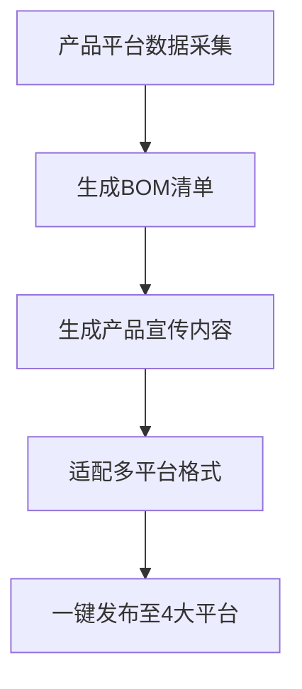

# 微信发布插件·中小企业内容数字员工

## 触发条件
当用户提到以下关键词时激活本技能：
- 内容创作、产品宣传、BOM生成、一键发布
- 公众号/小红书/抖音/智能体社区内容发布
- 中小企业内容数字员工、老板内容助手

## 现有能力
1. **双文章系统**（`dual-article-system/`）：已支持微信公众号+小红书双平台内容生成，自动适配平台风格
2. **命令体系**（`commands/`）：
   - `wx-publish.md`：微信公众号发布
   - `wx-hotspot.md`：热点追踪与选题
   - `wx-diary.md`：日记式内容生成
   - `wx-setup.md`：插件配置
3. **内容资产**（`docs/`、`data/`）：
   - 公众号vs小红书风格差异、爆款公式复盘等风格指南
   - 选题历史、话题库
4. **技术栈**：
   - cheerio：HTML解析与内容提取
   - playwright：浏览器自动化发布
   - mysql2：产品数据存储
   - 可集成 `ai-image-generation`、`ai-video-generation` 技能生成多媒体内容

## 扩展计划（待实现）
1. **产品平台数据采集**：对接产品平台API，自动采集产品参数、规格、卖点（需提供产品平台API文档）
2. **BOM生成**：根据产品数据自动生成BOM清单（需提供BOM格式规范与示例）
3. **多平台内容扩展**：
   - 新增抖音内容模板（15-60s短视频脚本、话题标签）
   - 新增智能体探索社区内容模板（技术向、案例向）
4. **一键多平台发布**：
   - 扩展 `commands/multi-publish.md`：支持微信+小红书+抖音+智能体社区同步发布
   - 集成各平台API（需提供小红书、抖音、智能体社区发布接口文档）

## 核心工作流

## 参考文件
- 双文章系统：`dual-article-system/dual_article_generator.js`、`dual-article-system/README.md`
- 发布命令：`commands/wx-publish.md`
- 风格指南：`docs/公众号vs小红书风格差异.md`、`docs/爆款公式复盘.md`
- 配置示例：`config/example-config.json`

## 待用户提供信息
1. 产品平台API文档（数据采集接口、认证方式）
2. BOM格式规范（必填字段、输出格式：Excel/JSON/Markdown）
3. 各平台发布要求：
   - 小红书：API文档、内容长度限制、话题规则
   - 抖音：视频上传接口、文案规范、挂载要求
   - 智能体探索社区：发布接口、内容偏好
4. 示例产品数据（1-2个产品信息，用于测试）
