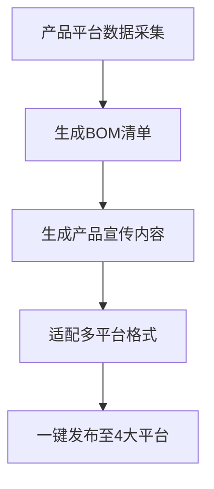

# 微信发布插件·中小企业内容数字员工

## 触发条件
当用户提到以下关键词时激活本技能：
- 内容创作、产品宣传、BOM生成、一键发布
- 公众号/小红书/抖音/智能体社区内容发布
- 中小企业内容数字员工、老板内容助手

## 现有能力
1. **双文章系统**（`dual-article-system/`）：已支持微信公众号+小红书双平台内容生成，自动适配平台风格
2. **命令体系**（`commands/`）：
   - `wx-publish.md`：微信公众号发布
   - `wx-hotspot.md`：热点追踪与选题
   - `wx-diary.md`：日记式内容生成
   - `wx-setup.md`：插件配置
3. **内容资产**（`docs/`、`data/`）：
   - 公众号vs小红书风格差异、爆款公式复盘等风格指南
   - 选题历史、话题库
4. **热点采集系统**（`scripts/fetch-hot.js`）：
   - 三平台并行抓取：**微博热搜** + **知乎热榜** + **Reddit 热点**
   - Reddit 支持 5 个核心社区：AskReddit / technology / China / worldnews / AmItheAsshole
   - 统一爆款评分（热度 + 公共性 + 画面感 + 故事性）
   - 自动识别适合短视频的 Reddit 故事类帖子（标注 `[VIDEO]`）
   - 未配置 Reddit 时自动跳过，不影响微博/知乎采集
5. **热点采集系统**（`scripts/fetch-hot.js`）：
   - 四平台并行抓取：**微博热搜** + **知乎热榜** + **Reddit 热点** + **宇树具身智能社群**
   - Reddit 使用 PowerShell 方式抓取（无需 API Key，自动走 WinINET 系统代理）
   - 宇树 unifolm.com 资源采集（开源项目、数据集、论文、产品新闻）
   - 统一爆款评分（热度 + 公共性 + 画面感 + 故事性）
   - 自动识别适合短视频的 Reddit 故事帖（标注 `[VIDEO]`）
6. **技术栈**：
   - cheerio：HTML解析与内容提取
   - playwright：浏览器自动化发布
   - mysql2：产品数据存储
   - 可集成 `ai-image-generation`、`ai-video-generation` 技能生成多媒体内容

## CMS 集成能力（v4.0 新增）
1. **CMS 栏目生成器**（`scripts/cms-column-generator.js`）：
   - 根据关键词/AI 自动生成 `lvbo_type` 栏目结构
   - 支持 `--from-config` 从配置读取关键词
   - 支持 `--keywords` 手动指定关键词 + `--name` 栏目名称
   - 自动分配 typeid、计算 fid 和 path 层级
   - 生成 INSERT SQL 语句，`--write-db` 直接写入数据库
   - 支持 `--from-sql` 从 SQL 文件加载现有栏目
   - `--dry-run` 仅预览不执行
2. **CMS 模板生成器**（`scripts/cms-template-generator.js`）：
   - 根据栏目信息自动生成首页/列表页/详情页三个模板
   - 使用 AI（DeepSeek）生成差异化 Banner、内容区块
   - 模板遵循 ThinkPHP 引擎语法，参考 huatian 主题风格
   - `--typeid` 指定栏目，`--all` 同时为子栏目生成
   - 自动更新 `lvbo_type` 表的 list_path/page_path
   - 支持自定义 `--output-dir` 输出目录

## 扩展计划
- [x] **Reddit 短视频管线**（`scripts/reddit-video/`）：Reddit 帖子自动变短视频（抓帖→TTS→截图→FFmpeg合成）
- [x] **Reddit 热点采集**：接入 fetch-hot.js，统一三平台爆款选题
- [x] **宇树 unifolm.com 资源采集**：独立采集器 scripts/fetch-unifolm.js，含资源/产品新闻采集
- [ ] 产品平台数据采集：对接产品平台API，自动采集产品参数、规格、卖点
- [ ] BOM生成：根据产品数据自动生成BOM清单
- [ ] 多平台内容扩展：抖音、智能体社区模板
- [ ] 一键多平台发布：微信+小红书+抖音+智能体社区同步发布

## 核心工作流

## 参考文件
- 双文章系统：`dual-article-system/dual_article_generator.js`、`dual-article-system/README.md`
- 发布命令：`commands/wx-publish.md`
- 风格指南：`docs/公众号vs小红书风格差异.md`、`docs/爆款公式复盘.md`
- 配置示例：`config/example-config.json`

## 待用户提供信息
1. 产品平台API文档（数据采集接口、认证方式）
2. BOM格式规范（必填字段、输出格式：Excel/JSON/Markdown）
3. 各平台发布要求：
   - 小红书：API文档、内容长度限制、话题规则
   - 抖音：视频上传接口、文案规范、挂载要求
   - 智能体探索社区：发布接口、内容偏好
4. 示例产品数据（1-2个产品信息，用于测试）
