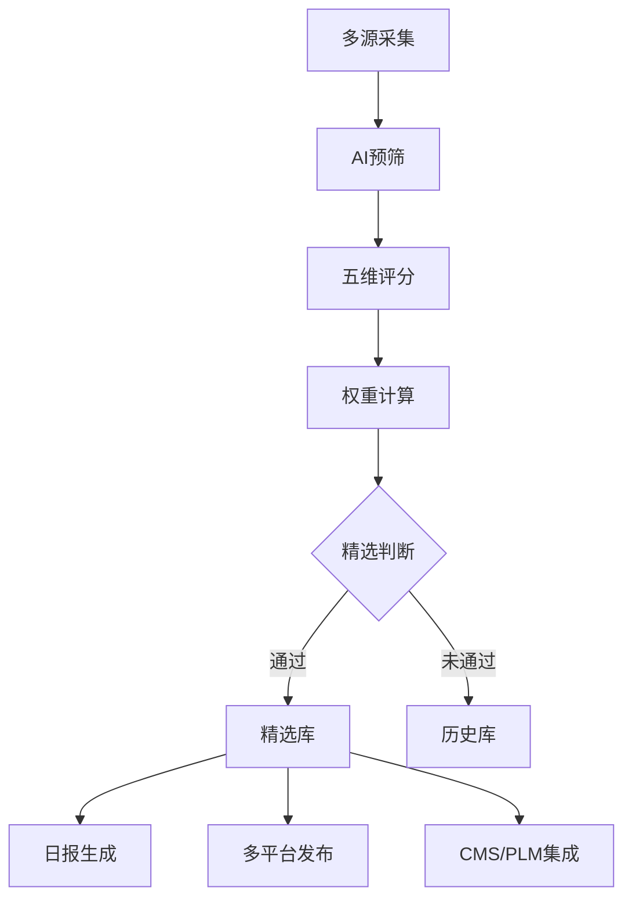

# 数字内容管理平台·内容数字员工 v5.0

## 触发条件
当用户提到以下关键词时激活本技能：
- 内容创作、产品宣传、BOM生成、一键发布
- 公众号/小红书/抖音/智能体社区内容发布
- 中小企业内容数字员工、老板内容助手

## 核心能力 v5.0

### 1. 信源管理系统
多平台、多层级信源配置，支持动态扩展：

| 层级 | 说明 | 权重 | 示例 |
|------|------|------|------|
| **T1** | 官方一手信息 | 1.5x | OpenAI Blog、Anthropic Blog、华为公告 |
| **T1.5** | 官方社媒账号 | 1.2x | OpenAI Twitter、小米微博 |
| **T2** | KOL/专业媒体 | 1.0x | 36氪、机器之心、微博热搜 |
| **T3** | 垂直行业源 | 0.8x | 具身智能社群、Reddit |

**已接入信源**：
- 微博热搜（T2）
- 知乎热榜（T2）
- Reddit 5个社区（T2-T3）
- 宇树具身智能社群（T3）

**配置文件**：`scripts/sources-config.json`

### 2. AI 处理中心

#### 2.1 预筛 AI 相关性
- 低成本模型（DeepSeek V3）预筛
- 过滤非相关内容，节省 API 成本

#### 2.2 五维评分系统
参考 AIHOT 11 版迭代经验，多维度量化评分：

| 维度 | 权重 | 说明 |
|------|------|------|
| 新颖性 | 20% | 最新发布/首次报道 |
| 重要性 | 25% | 影响范围、行业影响 |
| 相关性 | 20% | 与目标领域相关度 |
| 可读性 | 15% | 内容质量、信息密度 |
| 传播性 | 20% | 话题性、讨论潜力 |

**核心模块**：`scripts/ai-scorer.cjs`

#### 2.3 事件聚类
- Embedding 语义相似度
- 时间窗口聚合（24小时）
- 权威源优先：官网 > 官推 > KOL > 媒体

### 3. 精选推荐
- 按分类阈值过滤（不同分类不同阈值）
- 实时更新时间线
- 支持用户自定义兴趣标签

### 4. AI 日报
- 每日 8:00 自动生成
- 五大版块：模型发布、产品更新、行业动态、论文研究、观点技巧
- 已处理数据直接聚合，1秒生成

### 5. 多平台发布
| 平台 | 内容类型 | 发布方式 |
|------|---------|---------|
| 微信公众号 | 长图文 | Playwright 自动化 |
| 小红书 | 图文笔记 | API / 自动化 |
| 抖音 | 短视频 | API / 自动化 |
| CMS | 企业官网 | 数据库直写 |
| PLM | 产品文档 | API 集成 |

### 6. CMS 集成（v4.0）
1. **CMS 栏目生成器**（`scripts/cms-column-generator.js`）
2. **CMS 模板生成器**（`scripts/cms-template-generator.js`）

### 7. 存储系统
- 支持 MySQL 和本地 JSON 两种模式
- 环境变量 `CONTENT_STORAGE` 切换
- 自动去重、历史查询、全文搜索

**核心模块**：`scripts/content-storage.cjs`

## 快速开始

```bash
# 完整流水线（采集 → AI评分 → 精选）
node scripts/content-pipeline.cjs

# 单源采集
node scripts/content-pipeline.cjs weibo-hot

# AI 评分测试
node scripts/ai-scorer.cjs
```

## 环境变量

```bash
# AI 模型
DEEPSEEK_API_KEY=your_key_here

# 存储（json 或 mysql）
CONTENT_STORAGE=json
CONTENT_DATA_PATH=./data/contents

# MySQL（如果使用 mysql 存储）
CMS_DB_HOST=localhost
CMS_DB_PORT=3306
CMS_DB_USER=root
CMS_DB_PASS=password
CMS_DB_NAME=content_platform
```

## 旧能力保留
1. **双文章系统**（`dual-article-system/`）：微信公众号+小红书双平台内容生成
2. **命令体系**（`commands/`）：发布、热点、日记等命令
3. **Reddit 短视频管线**（`scripts/reddit-video/`）：抓帖→TTS→截图→FFmpeg合成
4. **技术栈**：cheerio + playwright + mysql2

## CMS 集成能力（v4.0 新增）
1. **CMS 栏目生成器**（`scripts/cms-column-generator.js`）：
   - 根据关键词/AI 自动生成 `lvbo_type` 栏目结构
   - 支持 `--from-config` 从配置读取关键词
   - 支持 `--keywords` 手动指定关键词 + `--name` 栏目名称
   - 自动分配 typeid、计算 fid 和 path 层级
   - 生成 INSERT SQL 语句，`--write-db` 直接写入数据库
   - 支持 `--from-sql` 从 SQL 文件加载现有栏目
   - `--dry-run` 仅预览不执行
2. **CMS 模板生成器**（`scripts/cms-template-generator.js`）：
   - 根据栏目信息自动生成首页/列表页/详情页三个模板
   - 使用 AI（DeepSeek）生成差异化 Banner、内容区块
   - 模板遵循 ThinkPHP 引擎语法，参考 huatian 主题风格
   - `--typeid` 指定栏目，`--all` 同时为子栏目生成
   - 自动更新 `lvbo_type` 表的 list_path/page_path
   - 支持自定义 `--output-dir` 输出目录

## 架构图

```
┌─────────────────────────────────────────────────────────────┐
│                    内容数字员工平台 v5.0                     │
├─────────────────────────────────────────────────────────────┤
│                                                             │
│  ┌─────────────┐    ┌─────────────┐    ┌─────────────┐     │
│  │ 信源管理    │───▶│ AI 处理中心 │───▶│ 内容输出    │     │
│  └─────────────┘    └─────────────┘    └─────────────┘     │
│        │                   │                   │            │
│        ▼                   ▼                   ▼            │
│  ┌─────────────┐    ┌─────────────┐    ┌─────────────┐     │
│  │ T1 官方源   │    │ 预筛 AI相关性│    │ 精选推荐    │     │
│  │ T1.5 官方社媒│   │ 多维评分    │    │ 日报生成    │     │
│  │ T2 KOL/媒体 │    │ 事件聚类    │    │ 多平台发布  │     │
│  │ T3 行业垂直 │    │ 翻译+摘要   │    │ CMS/PLM集成 │     │
│  └─────────────┘    └─────────────┘    └─────────────┘     │
│                                                             │
└─────────────────────────────────────────────────────────────┘
```

## 扩展计划
- [x] 信源管理系统（T1-T3 分层）
- [x] AI 五维评分系统
- [x] 内容存储模块（JSON/MySQL）
- [x] 主采集管线
- [ ] Embedding 事件聚类
- [ ] Web 管理界面
- [ ] API 服务封装
- [ ] PLM 深度集成

## 核心工作流



## 参考文件
- 双文章系统：`dual-article-system/dual_article_generator.js`、`dual-article-system/README.md`
- 发布命令：`commands/wx-publish.md`
- 风格指南：`docs/公众号vs小红书风格差异.md`、`docs/爆款公式复盘.md`
- 配置示例：`config/example-config.json`

## 参考文档
- 设计方案：`docs/content-platform-v5-plan.md`
- 信源配置：`scripts/sources-config.json`
- AI 评分：`scripts/ai-scorer.cjs`
- 主管线：`scripts/content-pipeline.cjs`
- 存储模块：`scripts/content-storage.cjs`

## 成本估算
**AI 调用成本（每日 500 条）**：
- 预筛：¥0.25/天
- 评分：¥5.00/天
- 翻译摘要：¥2.50/天
- **总计：≈ ¥240/月**

优化方案：本地模型预筛 + 批量处理 + 缓存相似内容
