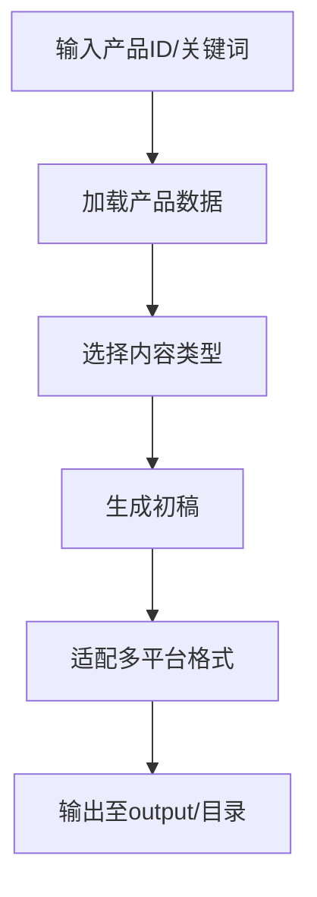

# 内容创作命令

## 功能
基于产品数据与BOM清单，自动生成多形态宣传内容：
1. **图文文章**：适配微信公众号（长文）、小红书（短笔记）、智能体社区（技术文）
2. **视频脚本**：适配抖音（15-60s短视频）、智能体社区（教程/案例视频）
3. **自动匹配平台风格**：复用`docs/公众号vs小红书风格差异.md`、`docs/爆款公式复盘.md`

## 前置条件
1. 已完成产品数据采集（执行`product-data-collect`）或手动提供产品信息
2. 可选：已生成BOM清单（执行`bom-generate`），用于内容中嵌入产品参数
3. 已在`config/user-config.json`配置内容偏好：
   ```json
   {
     "content": {
       "tone": "专业且易懂", // 专业/活泼/简洁
       "targetAudience": "中小企业老板/工程师",
       "keywordDensity": 3, // 关键词密度%
       "includeBOM": true // 内容中是否嵌入BOM信息
     }
   }
   ```

## 执行流程


## 内容输出示例
### 1. 微信公众号文章（`output/articles/wechat_isc2000_20260429.md`）
```markdown
# 工业级精度，这款传感器如何帮工厂降本30%？

## 痛点直击
传统压力传感器精度低、易漂移，导致生产停机损失年均超10万元...

## 产品亮点
✅ **±0.1%超高精度**：ISC-2000采用进口敏感芯片，温漂小于0.01%/℃
✅ **IP67防护**：适应恶劣工业环境，平均无故障时间5年+
✅ **即插即用**：支持Modbus RTU，无需额外转换器

## BOM清单（节选）
| 核心元件 | 规格 | 供应商 |
|----------|------|--------|
| 压力敏感芯片 | 量程0-100MPa | 芯感科技 |
| 信号放大电路 | 4-20mA输出 | 华强电子 |

[点击查看完整BOM](BOM_ISC-2000_20260429.xlsx)

## 适用场景
智能制造、过程控制、设备监测...（全文1500字+）
```

### 2. 抖音短视频脚本（`output/videos/douyin_isc2000_20260429.txt`）
```
【15s版】
0-3s：特写传感器在工业现场运行，字幕“精度差导致停机？”
3-8s：展示ISC-2000产品，旁白“±0.1%精度，5年无故障”
8-12s：对比传统传感器，旁白“降本30%，每年省10万”
12-15s：引导点击小黄车，“立即咨询，获取方案”

【60s版】
（详细脚本含镜头、台词、BGM、字幕提示）
```

## 平台适配规则
| 平台 | 文章长度 | 视频时长 | 必带元素 |
|------|----------|----------|----------|
| 微信公众号 | 800-2000字 | - | 封面图、摘要、原文链接 |
| 小红书 | 300-800字 | 15-60s | 话题标签≥3、产品图≥3 |
| 抖音 | - | 15-60s | 挂载链接、POI地址、挑战赛 |
| 智能体社区 | 1000-3000字 | 60-180s | 技术参数、案例数据、开源协议 |

## 集成能力
- **文章生成**：复用`dual-article-system/dual_article_generator.js`
- **视频脚本**：调用`ai-video-generation`技能生成分镜脚本
- **配图生成**：调用`ai-image-generation`技能生成产品宣传图

## 待用户提供
1. 内容风格偏好：正式/活泼/技术向（示例文章）
2. 关键词库：行业关键词、产品卖点词（用于SEO优化）
3. 视频素材：产品演示视频、工厂实拍素材（用于视频生成）
4. 测试产品ID：用于生成首篇示例内容
